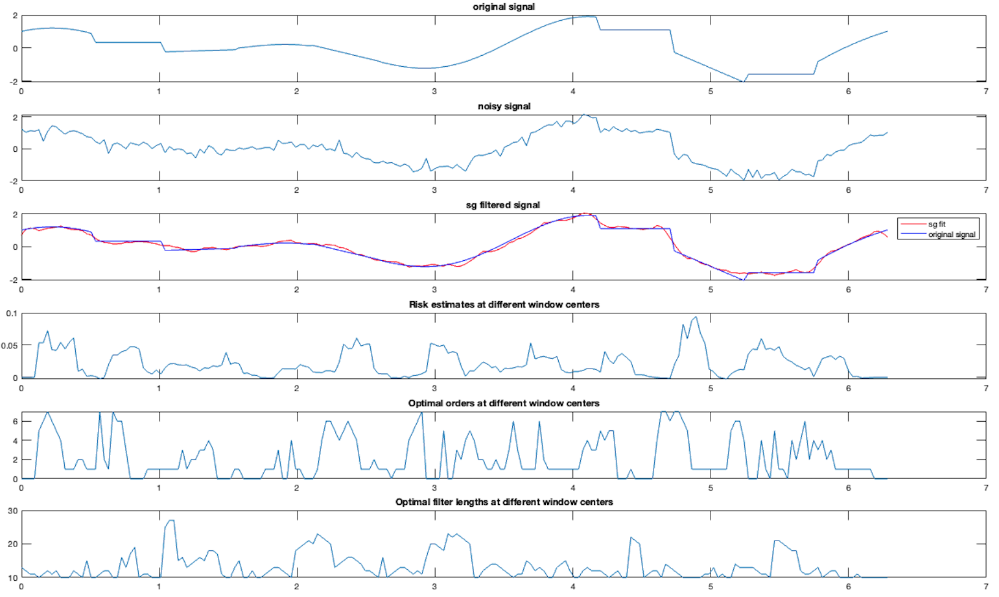

# Adaptive Savitzky Golay Filter
Implementation of [Adaptive Savitzky-Golay filter in Non-Gaussian Noise](https://ieeexplore.ieee.org/document/9521788) by Arlene John et al. in Matlab

## Preview

### You may freely modify, distribute and use this implementation provided that you cite this repository and the paper referenced above.
